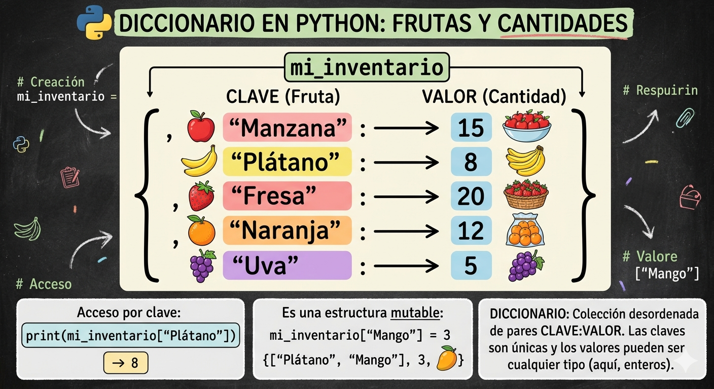

# DICCIONARIO EN PYTHON
conseptos y ejercicios de diccionarios en python

- los diccionarios son datos estructurados, es decir, hacen referencia a una coleccion de datos.
- son una coleccion desordenada de pares de datos de la forma 
**clve:valor**, conocidos como elementos o items
- son mutables, una vez definidos se le puede agregar nuevos elementos modificar o eliminar algunos de los que ya tiene
- tambien son conocidos como arreglos asociativos

## REPRECENTACION GRAFICA DIRECTA 



## Sintaxis

`nombre_diccionario = {clave1:valor1,   clave2:valor2,...}`

- cada item o elemento tiene la forma **clave:valor**
- en cada item hay uno o mas valores, si se desconoce el valor, se puede cambiar 
- los elementos del diccionario se indexan por la clave
- las claves solo puedes ser datos inmutables
- los valores pueden ser datosmutables o inmutables 
- las claves no pueden repetirse dentro de un diccionario
### ejemplo

`frutas = {'manzana':34, 'pera':45}`

## operaciones

### agregar elementos

`nombre_diccionario[clave] = valor`

`frutas['cereza'] = 90`

### consultar o modificar elementos

`print(el valor de pera es: ', frutas[pera])`
### eliminar elementos 

`del frutas [ṕera´]`

### operador de pertenenci

``` py
if 'cereza' in frutas:
    print('si esta cereza en eldigcionario')
else:
    print('No esta cereza en el diccionario')
```

## ejercicio
cree un programa en python que utilize un diccionario para guardar los nombres de sus amigos y su telefono. en este caso, el diccionario representa una agenda telefonica. el orograma pedira nombres y telefonos y los ira guardando en el diccionario(los nombres en mayuscula). Ademas, el programa debe permitir consultar o eliminar un telefono. incluya un menu de opciones